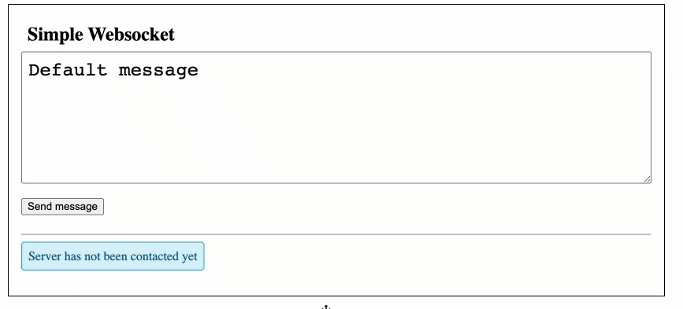

# Websocket manager

This is a simple implementation which show how to connect to a web server which expose a websocket
and to send and receive messages.

The server implements the websocket with library [ws](https://www.npmjs.com/package/ws),
the client used the browser API [WebSocket](https://developer.mozilla.org/en-US/docs/Web/API/WebSocket)

